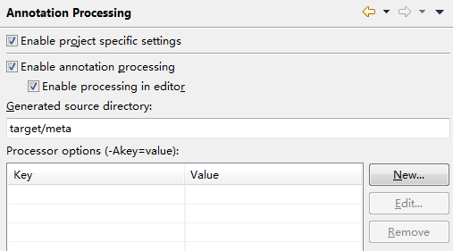
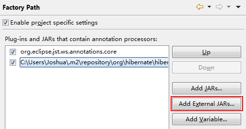

# 项目配置说明

因JPA使用了Hibernate的代码生成工具，需要在Eclipse项目中添加对应Annotation解析配置。

配置路径：

Java Compiler > Annotation Processing 
 
代码的生成目录可以用 `target/meta` 。

Java Compiler > Annotation Processing > Factory Path 
 
把本地的 `hibernate-jpamodelgen` Jar包添加进来。